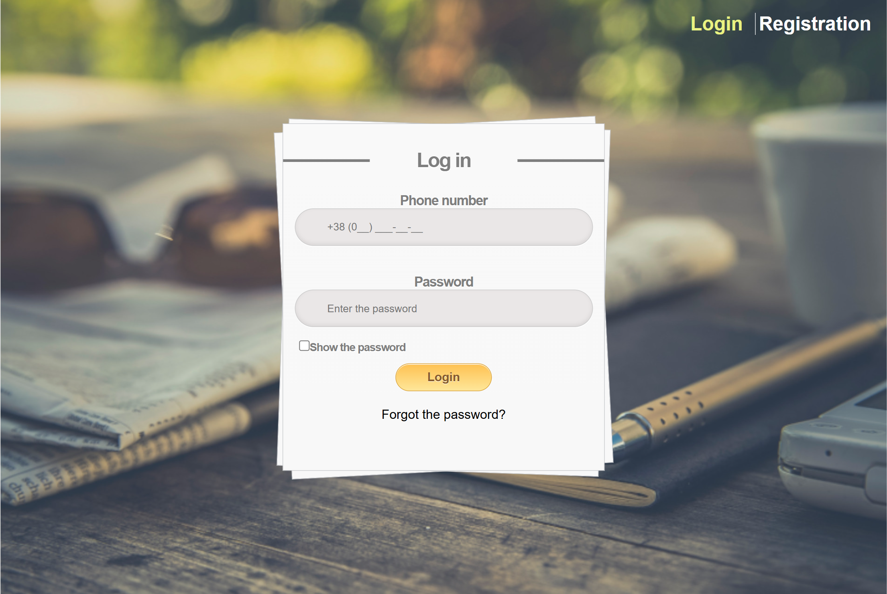

# Reminder - Reminder website solution

This web service helps users not to forget about important tasks, appointments and daily activities. With its help, you can create lists of reminders, specifying the date and time when they should go off. At the appointed moment, the user will receive a notification in Telegram messenger, which is especially convenient, as many people actively use messengers and will not miss an important message.

## Table of contents

- [Overview](#overview)
  - [Task](#Task)
  - [Screenshot](#screenshot)
  - [Links](#links)
- [My process](#my-process)
  - [Built with](#built-with)
  - [Skills applied](#Skills-applied)

## Overview

### Task

Users should be able to:

- Go through registration
- Log in with a login and password
- Create a reminder by specifying the date, time, and text of the reminder
- Have the ability to modify and delete reminders
- View the optimal layout for each of the website's pages depending on their device's screen size
- See hover states for all interactive elements on the page

### Screenshot

### Links

- Solution URL: [My solution](https://github.com/Fender60/jwtAuth.git)
- Live Site URL: [Live site](https://fender60.github.io/jwtAuth/)

## My process

### Built with

- Semantic HTML5 markup
- Methodology BEM
- CSS custom properties
- SCSS
- Flexbox
- React
- Material UI
- Axios
- React hook form
- React router

### Skills applied

- Customizing form validation
- Sending requests to the server, saving data in the database, receiving and processing the response from the server.
- Error handling
- Passing the registration, and getting a jwt token to log in to the page
- Working with react routers for page navigation
- Saving and reading data in localstorage
- Loading reminders on page scrolling
- Creating a Telegram bot to send messages at specified times